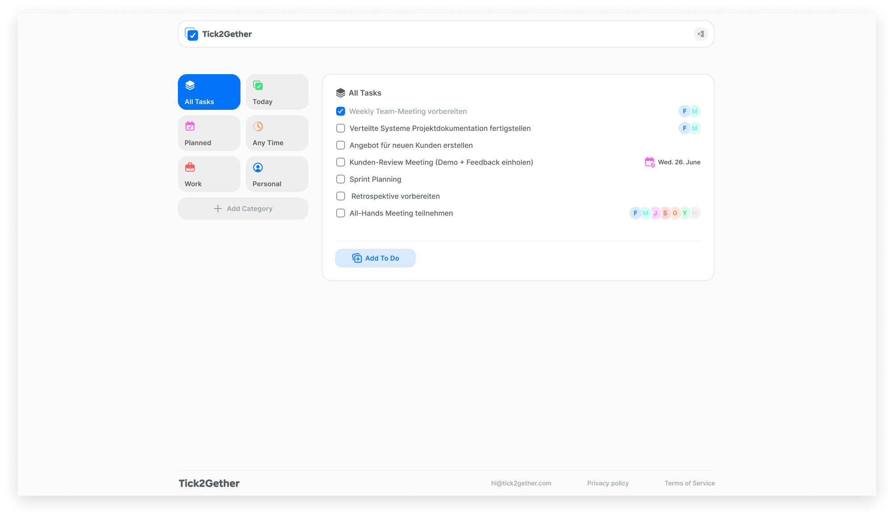

# Tick2Gether

Tick2Gether is a real-time task and collaboration platform designed for teams and individuals who want to manage tasks efficiently and stay synchronized.

It combines structured task management with live updates across all clients.

---

## Problem

Task management tools often lack real-time synchronization or become overly complex.

Teams lose time due to:
- outdated task states
- poor collaboration flow
- fragmented communication

---

## Solution

Tick2Gether provides a lightweight, real-time task system where all changes are instantly reflected across users.

It focuses on:
- simplicity
- responsiveness
- real-time collaboration

---

## Features

- **Task Dashboard**  
  Central overview of all tasks and their status

- **Categorization**  
  Organize tasks into logical groups

- **Real-Time Updates**  
  Changes are instantly synchronized across all clients using WebSockets

- **Authentication**  
  Secure login and registration via JWT

- **Task Scheduling**  
  Deadlines and planning support

---

## System Design

Tick2Gether follows a client-server architecture with real-time communication:

- React frontend communicates via REST API
- WebSocket layer pushes updates to all connected clients
- Backend manages business logic and persistence

---

## Tech Stack

- **Frontend**: React  
- **Backend**: Spring Boot  
- **Realtime Communication**: WebSockets  
- **API**: REST  
- **Database**: MySQL  
- **Authentication**: JWT  

---

## Preview

---

## Notes

This project focuses on building a responsive, real-time system with a clean separation between frontend and backend.

Key challenge: ensuring consistent state across clients in real time.
